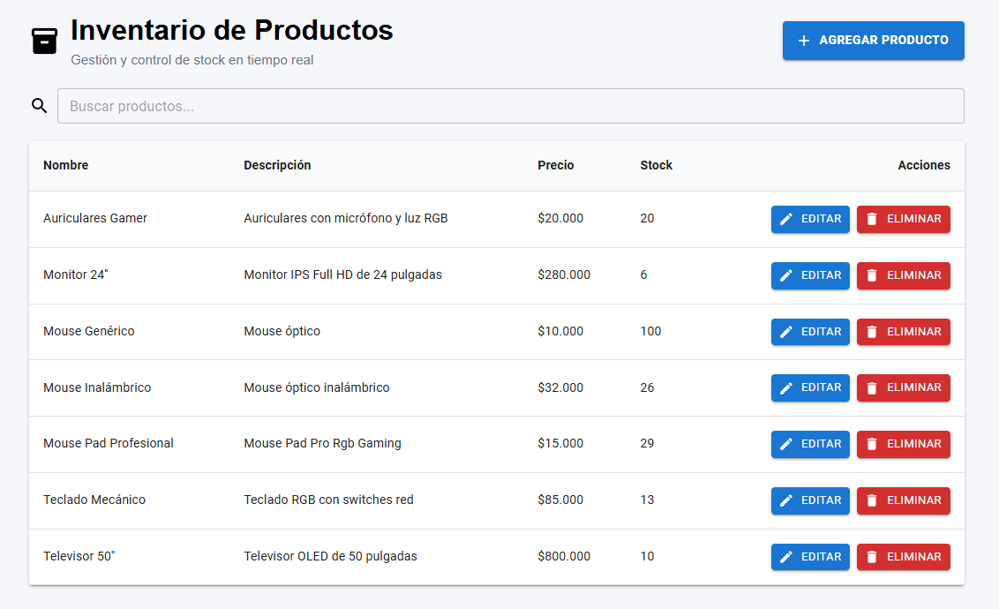

# Inventario de Productos

## De qué trata el proyecto

Es una aplicación web pensada para gestionar un inventario de productos. Permite ver, agregar, editar y eliminar registros en una base de datos. La idea es tener una interfaz sencilla e intuitiva para administrar stock sin necesidad de herramientas complejas.

---

## Qué tecnologías y arquitectura se eligieron y por qué

**Frontend:**
- React + TypeScript → React por su popularidad y facilidad para armar componentes reutilizables; TypeScript para tener tipado y evitar errores comunes.
- Vite → elegido por la rapidez en el entorno de desarrollo y compilación.
- Material UI → para no reinventar la rueda en estilos y contar con componentes listos, responsivos y consistentes.

**Backend:**
- Supabase → se eligió como Backend-as-a-Service porque ofrece PostgreSQL y API lista para operaciones CRUD. Esto evita tener que levantar un backend propio y acelera el desarrollo.

**Arquitectura:**
- Basada en componentes.  
- La lógica principal está en `App.tsx` y los componentes se encargan de mostrar datos y manejar acciones del usuario.  
- Los principales componentes son:  
  - `InventoryTable`: listado y acciones sobre productos.  
  - `FormularioProducto`: creación/edición.  
  - `ConfirmarEliminar`: confirmación antes de borrar.  
  - `Mensaje`: notificaciones de éxito/error.

Esta separación facilita el mantenimiento y la reutilización del código.

---

## Funcionalidades

- Visualización de productos.
- Alta de productos.
- Edición de productos.
- Eliminación de productos.
- Búsqueda por nombre o descripción.
- Validación de formularios.
- Confirmación antes de eliminar.
- Mensajes de éxito y error.
- Indicador de carga durante la obtención de datos.

---

## Qué herramientas de IA utilizaste y cómo te ayudaron

Se usó **ChatGPT** como apoyo durante el desarrollo.  
Ayudó en:
- Resolver dudas rápidas sobre React, TypeScript y MUI.  
- Proponer estructuras de componentes y arquitectura.  
- Refactorizar código y detectar errores.  
- Mejorar la experiencia de usuario con buenas prácticas.

Se usó **Banani** para simplificar la construcción de la UI de la pantalla principal
Se usó **Copilot** como guía para formular la documentación.

Todas las decisiones finales de implementación fueron revisadas, adaptadas e integradas manualmente en el proyecto.

## Cómo instalarlo y correrlo localmente

1. Clonar el repositorio:
   ```bash
    git clone https://github.com/FrancoValansi/inventario-productos.git
    ```

2. Entrar al proyecto:
    ```bash
    cd inventario-productos
    ```

3. Instalar dependencias:
    ```bash
    npm install
    ```

4. Crear un archivo .env en la raíz con las variables de Supabase:
    ```env
    VITE_SUPABASE_URL=TU_URL_DE_SUPABASE
    VITE_SUPABASE_PUBLISHABLE_KEY=TU_CLAVE_PUBLICA
    ```

5. Iniciar el servidor de desarrollo:
    ```bash
    npm run dev
    ```

La aplicación quedará disponible en:
    http://localhost:5173

---

## Demo

La aplicación desplegada puede consultarse en:

**https://inventario-productos-orcin.vercel.app/**

---

## Captura



---

## Autor

Franco Agustín Valansi Miraglia